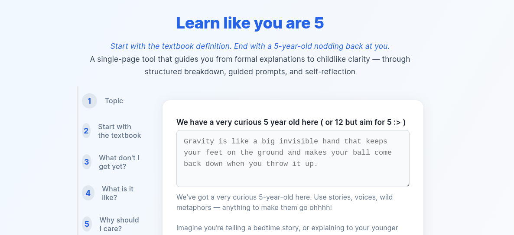
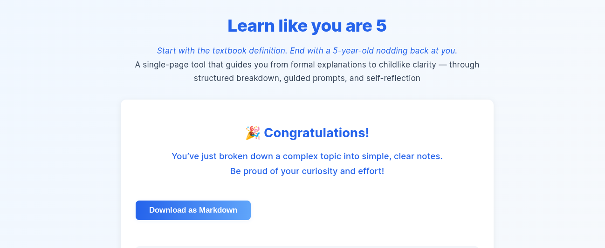

# 🧠 Learn Like You Are 5

> _Start with the textbook definition. End with a 5-year-old nodding back at you._

**Learn Like You Are 5** is a gentle, structured tool that helps you understand complex topics deeply — not by memorizing, but by breaking them down, connecting the dots, and explaining them like you would to a curious child.

From confusion to clarity — through analogies, reflection, and self-kindness. By the end, you’ll have clean notes and a clearer mind.

---

## ✨ What It Does

This site walks you through a single-page learning journey:

- 🧠 **Name the topic** you want to understand
- 📚 **Write out the textbook definition**
- 🔍 **Highlight words or steps you don't get**
- 🌍 **Zoom out to the bigger picture**
- 🎭 **Describe what it’s like — in metaphors**
- 💬 **Relate it to your life**
- 🧾 **Say it simply — in your own words**
- 👶 **Explain it like a bedtime story**

You’ll end with a beautifully structured Markdown note — ready to copy, save, or share.

---

## 💻 Try it out

👉 [Learn like you are 5](http://lalithaar.github.io/learn-better/)  

---

## 🌱 Who It’s For

- Students who want to **really get it**
- Curious minds who love connecting the dots
- Teachers promoting metacognition
- Anyone stuck between “I kinda get it” and “I truly understand it”

---

## 🛠 Built With

- **Vue 3** (Composition API)
- Native HTML form elements
- Zero dependency form libraries
- Markdown generation with JavaScript

No fancy plugins. Just heartfelt, reactive code.

---

## 📸 Preview

### Step-by-step Form

### Personalized Notes

---

## 📄 License

This project is licensed under the **GNU General Public License v3.0 (GPLv3)**.

You are free to use, modify, and share this project — but derivative works must remain under the same license.

> This is a learning tool made with care. May it spread freely and help deeply. 🌱

---

## 🤍 A Final Note

This tool was born from the feeling of “I don’t get it… and that’s okay.”

You’re not supposed to already know everything.  
You’re here. You’re learning. You’re doing beautifully.

Be proud of your effort.  
Be kind to your mind.  
And keep learning like you're five 🐣

---
